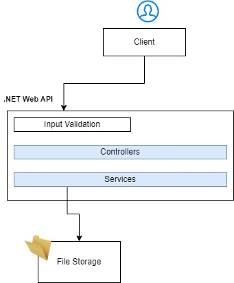
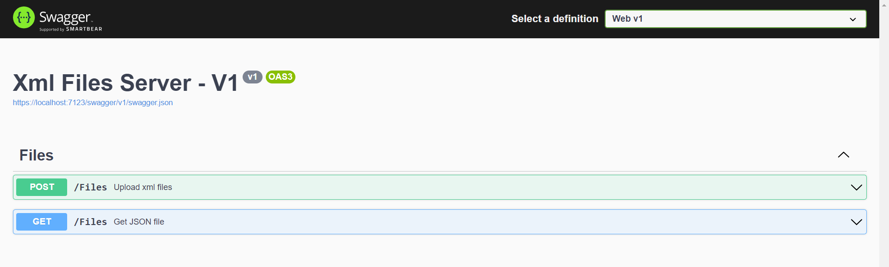
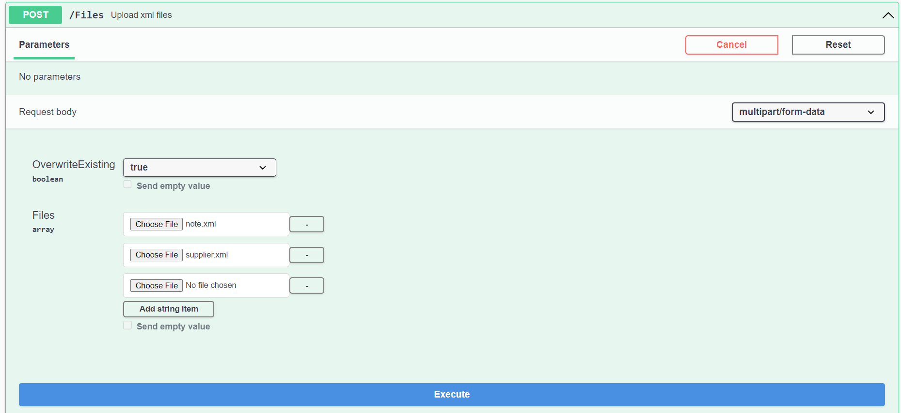
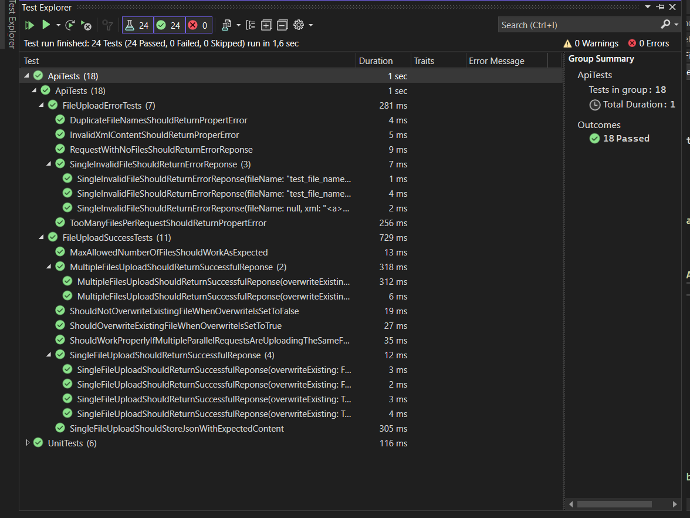

# XML Files Server

## Description

A simple API with 2 layered architecture. The first layer is presentation layer with thin controllers. The second layer is the application layer containing the services for storing and fetching the files.

There is an additional validation layer in front of the presentation layer, implemented with Fluent Validation for validation of the user input.

All files within a single request are processed in parallel.

All files operation are designed to work properly in a concurrent environment. So for example if two users are uploading a file with the same name simultaniously, there should not be an error caused by multiple processes operating on a same resource.

The above considerations are covered in the api tests.

## How to use

1. Host the application locally
1. Swagger UI will show on the localhost URL with two endpoints
   
1. The POST endpoint is for creating files
   
   It accepts two parameters
   - OverwriteExisting - if true, any already existing json file will be overwritten. If set to false, the file will be skipped.
   - Files - the uploaded files. Could be 1 or many. There is a limitation of the number of files (see validation)
1. The GET endpoint returns the stored json file. You need to provide the json file name. If the file is not existing, 404 (Not found) is returned.

# Validation

For validation the user input Fluent Validation is used. Due to performance considerations, the xml content validation is implemented in the business layer.
The following imput validation checks are implemented:

1. Upload FIle

   - At lest one file must be provided
   - The maximum files per request (10). This is extracted to configuration for easier maintenance
   - Only unique file names are allowed. (a different behavior may be considered here, like for example store only the last file with duplicate name)
   - Only xml files are accepted
   - The maximum allowed file size is 10 MB. This is extracted to configuration for easier maintenance
   - File name (without the extension) must be between 1 and 20 characters. This is extracted to configuration for easier maintenance
   - File name cannot be null
   - File content cannot be empty
   - Only valid xml content can be provided

2. Get file
   - Only JSON files can be requested
   - File name cannot be empty

In case of validation error status 400 (Bad request) with proper validation message is returned. If one of the files is rejected due to validation reasons, all of the files are rejected.

## Tests

    To run the test make sure that in the `appsettings.json` of the ApiTests project the correct file storing location is set. It's needed, because before each test, the location is being emptied.

The default configured location is in `/files` folder, relative to the API executing asssembly location.

### Unit tests

Some unit tests covering the file upload service are added covering the basic scenarios.

Two of the tests are asserting the parallel file processing behavior.

### API Tests

Some end-to-end API test are added as well to cover the main success and error scenarios.

For both types of tests xUnit is used. For the unit tests Moq is used to mock the dependencies behavior.

### Main Nuget libraries used

1. Newtonsoft.Json - used for serialization/deserialization and convertion between xml and json
1. FluentValidation - for validation user input
1. Moq - for mocking the dependencies behavior in the unit tests.
1. Xunit - unit tests and api tests
